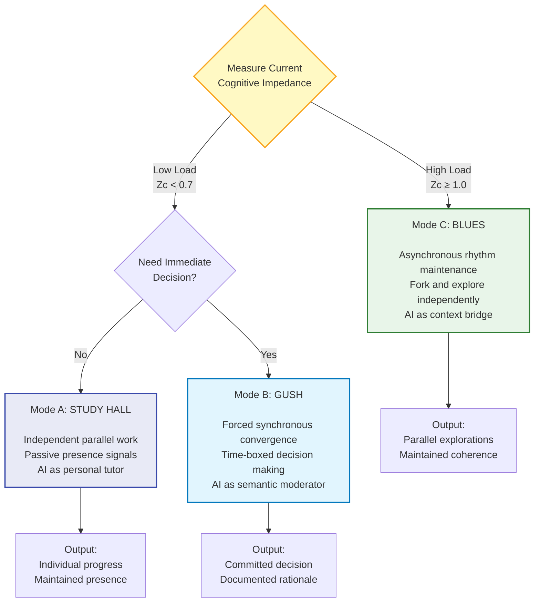

# The CIM Protocol
## Cognitive Impedance Mismatch & Dynamic Mode Switching in Hybrid Teams

**Version:** 2.0.0 — *The CIM Protocol*  
**Status:** Canonical Specification & Operational Framework  
**Domain:** Cognitive Engineering / Distributed Intelligence / Stigmergic Coordination  
**Date:** February 2026  
**Authors:** Fabrizio Terzi @Bergamo|Hub (Pyragogy Node), in dialogue with the Peeragogy Community  
**Historical Context:** [CASE-000: The CRDT Bridge Event](https://groups.google.com/g/peeragogy/c/XxC3qJ1wegs)  
**License:** MIT – Open Source Cognitive Infrastructure


---

> *"The problem isn't that your team is slow. The problem is that you're generating insights faster than anyone can integrate them."*

---

## Introduction: The Collaboration Paradox

Here's what nobody tells you about modern teamwork: the better your team gets at thinking, the worse it gets at deciding.

You hire smart people. They generate ideas constantly. They spot patterns, propose solutions, share articles, debate approaches. Your Slack is alive with intelligence. And yet somehow, nothing moves forward. Meetings multiply. The same conversations repeat. Decision paralysis sets in. Your best people start looking exhausted.

This isn't a people problem. It's not a tools problem. It's a **topology problem**.

Your team is trying to run a synchronous collaboration model on an asynchronous information load. It's like trying to have a conversation in a nightclub—everyone's shouting, nobody's hearing, and the music just keeps getting louder.

We call this **Cognitive Impedance Mismatch**, and once you see it, you can't unsee it.

---

## Part I: Understanding Cognitive Impedance Mismatch (CIM)

### The Core Concept

**Cognitive Impedance Mismatch occurs when the rate at which a team generates information exceeds its collective capacity to process and integrate that information.**

Think of it like electrical impedance. When you plug a high-power device into a circuit that can't handle it, something breaks. Either the device doesn't work, or the circuit fries. In teams, the same thing happens—either good ideas get lost, or good people burn out.

### The Mathematics of Overload

The relationship is surprisingly simple:

$$Z_c = \frac{V_{generation}}{B_{social}}$$

Where:
- **Zc** represents Cognitive Impedance (the "stress" on your collaboration system)
- **V_generation** is the velocity of information entering the system (ideas, messages, decisions, questions)
- **B_social** is your team's social bandwidth—the actual capacity to read, process, discuss, and integrate

When this ratio approaches 1.0, your system is at capacity. When it exceeds 1.0, you're in cognitive debt. The backlog isn't just growing—it's compounding.

### Critical Thresholds

Through observation of teams under various loads, we've identified three zones:

**Green Zone (Zc < 0.7):** Healthy state. Information flows smoothly. Decisions happen. People feel engaged but not overwhelmed. This is where synchronous collaboration works beautifully.

**Yellow Zone (Zc 0.7-0.9):** Elevated stress. Response times increasing. Some conversations falling through cracks. Watch this carefully—you're approaching the breaking point.

**Red Zone (Zc ≥ 1.0):** System overload. Cognitive debt accumulating. People drowning. Synchronous collaboration becomes counterproductive. This requires immediate intervention.

### How to Recognize CIM in Your Team

You don't need precise measurements to know when you're in trouble. Watch for these patterns:

**Communication Symptoms:**
- Your primary communication channel feels like a fire hose
- People apologize for "being behind" on messages
- Important threads get buried before anyone can respond
- Someone asks "Can anyone summarize where we are on X?"

**Decision Symptoms:**
- The same topic gets discussed three times without resolution
- Meetings end with "let's continue this conversation async"
- People avoid making decisions because "we need to align with everyone first"
- Decisions get made, then quietly unmade as new information surfaces

**Social Symptoms:**
- Your best people are working nights and weekends to "catch up"
- Junior members stop asking questions because they don't want to add to the noise
- Sub-channels proliferate as people create spaces to "actually get work done"
- Team members describe feeling exhausted despite shipping less

If you're nodding your head right now, you have CIM. The question is: what do you do about it?

---

## Part II: The Framework—Three Modes, One Principle

Most teams respond to overload in predictable, destructive ways:

They **add more meetings** to "get everyone aligned." This increases synchronization cost while decreasing time to do actual work. Impedance goes up.

They **adopt new tools** hoping technology will solve a human problem. Slack becomes Teams becomes Discord. The tool changes, the overload doesn't.

They **tell people to work harder**, push through, stay late. This works for about two weeks before burnout sets in and productivity collapses.

None of these address the root cause: **you're using a fixed collaboration topology for a variable cognitive load.**

### The Core Insight

The CIM Protocol is built on a simple principle: **your collaboration mode should be a function of your cognitive impedance.**

When load is low, synchronous convergence works beautifully. Force alignment. Make decisions together. Move fast.

When load is high, forcing synchronization destroys value. You need to switch to asynchronous exploration. Maintain rhythm without demanding processing bandwidth. Let ideas fork, evolve, and reconverge when ready.

This isn't about working async vs sync. It's about **dynamic mode switching** based on system state.

### The Three Modes



Each mode is optimized for different system states. Let's examine them in detail.

---

## Part III: The Three Modes in Practice

### Mode A: Study Hall

**"We're here together, working in parallel."**

Think of a university library during finals week. Everyone's present. The room has energy. But nobody's interrupting anyone. You're alone together, and that's exactly the point.

#### When to Use This Mode

Mode A is your default state when cognitive load is manageable and team members have clear, independent work streams. It's the mode of exploration before convergence, of deep work before collaboration.

Use Study Hall when:
- Team members are researching, designing, or building independently
- You're in an exploration phase where parallel paths make sense
- People need uninterrupted time to think deeply
- Cognitive impedance is low (Zc < 0.7)

#### Operating Principles

**Presence Over Content**  
Team members signal that they're working and what they're focused on, but they don't demand processing bandwidth. A simple status update suffices: "Researching authentication patterns. Available at 2pm for questions."

**Interruptions Are Expensive**  
In Study Hall, interrupting someone requires justification. A quick question that "will only take a minute" actually costs 23 minutes—the interruption plus the time to regain deep focus. Respect this.

**Async-First Communication**  
Questions go in threads. Updates go in documents. If someone needs your input, they write it down so you can engage when you have capacity, not when they happen to need it.

**AI as Personal Tutor**  
In this mode, AI systems work individually with each team member. They help research, answer questions, and synthesize information. They don't broadcast to the team—that would increase cognitive load.

#### What This Looks Like

Monday morning. Sarah posts in the team channel: "Deep work on the payment gateway integration. Async questions welcome in #payments-thread. Back at 1pm."

Marcus is simultaneously researching database options. He's having a conversation with Claude about PostgreSQL vs MongoDB trade-offs, gathering information, running experiments. No one else sees this—they don't need to yet.

At 1pm, Sarah surfaces. She's made progress. She doesn't write a detailed report—that would ask everyone to process information. Instead: "Payment integration progressing well. Hit one blocker on error handling, documented in ticket #127. Will have proposal tomorrow."

This is Study Hall. Parallel progress. Maintained presence. Minimal coordination overhead.

#### Exit Conditions

Study Hall ends when:
- Individual work streams need to converge
- A decision point is reached that requires alignment
- Someone discovers information that changes the landscape for others

At that point, you explicitly switch modes.

---

### Mode B: GUSH (Generative Unified Semantic Harmonization)

**"We need a decision now, and we're going to make it together."**

GUSH is forced convergence. It's when you take asynchronous exploration and collapse it into synchronous decision-making. Done right, it's extraordinarily powerful. Done wrong, it's just another wasteful meeting.

#### When to Use This Mode

Use GUSH sparingly and intentionally. It's for moments when:
- A decision cannot be delayed or delegated
- Multiple stakeholders must align
- The decision has dependencies that affect others' work
- Cognitive impedance is low enough to support synchronous work (Zc < 0.7)

Critically: **Never GUSH in high impedance.** If your team is already overloaded, adding a synchronous meeting makes things worse. You need Mode C instead.

#### The GUSH Protocol

GUSH works because of strict constraints. Remove the constraints, and it degrades into a regular meeting—which means it probably fails.

**Pre-Session Requirements (24-48 hours before):**

All materials must be shared in advance. This includes:
- The specific decision to be made
- Background context and research
- Options being considered
- Criteria for evaluation
- Any relevant data or examples

Every participant must confirm they've reviewed these materials. If someone hasn't done the pre-work, the session is postponed. This is non-negotiable.

Why? Because reading during the meeting is cognitive waste. Six people sitting in a room while one person explains something that could have been a document is a catastrophic misuse of collective intelligence.

**Session Structure (45 minutes maximum):**

**Minutes 0-5: Context Refresh**  
Quick review of the decision at hand. Nobody's reading for the first time—they're refreshing what they already know.

**Minutes 5-10: AI-Generated Synthesis**  
The AI system presents a synthesis of the pre-work: "Here are the three options. Here's what each person said in their review. Here are the apparent points of agreement and disagreement."

This is crucial. It gives everyone a shared map of the conversation before the conversation starts.

**Minutes 10-35: Structured Discussion**  
This is not freeform brainstorming. The conversation is structured around:
- Clarifying questions (not new information—that should have been in pre-work)
- Surfacing concerns or considerations
- Testing assumptions
- Exploring implications

The AI system is actively listening, mapping the conversation, identifying emerging consensus or deadlock.

**Minutes 35-40: Decision Point**  
The group makes a decision. Not "we'll think about it." Not "let's do more research." A committed decision: we're doing X, not Y or Z, for these reasons.

**Minutes 40-45: Documentation**  
The AI system generates a decision document in real-time:
- What was decided
- What options were considered
- Why this decision was made
- What the implications are
- Who's accountable for what next

This document is published before people leave the room.

#### Why This Works

GUSH works because it respects cognitive economics. 

The pre-work means everyone arrives informed, not ignorant. The time box means there's urgency to decide, not drift. The AI synthesis means the group starts from a shared understanding. The mandatory documentation means the decision doesn't evaporate the moment people return to their desks.

It's not a meeting. It's a **decision ceremony**.

#### What This Looks Like

The team has been exploring authentication approaches in Study Hall mode for a week. Three different patterns have emerged. They need to pick one—the decision affects the entire architecture.

Tuesday at 9am: Decision doc shared. "We need to choose between OAuth, JWT, or session-based auth. Here's the research from three parallel explorations. Read by end of day Wednesday."

Wednesday at 2pm: Everyone confirms they've read the materials.

Thursday at 10am: GUSH session begins.

The AI presents: "All three approaches are technically viable. The main disagreement is about complexity vs. flexibility. OAuth gives us the most flexibility but highest initial complexity. JWT is middle ground. Session-based is simplest but least flexible."

The discussion focuses on: What does our 12-month roadmap look like? How much auth complexity can the team absorb right now? What are we optimizing for—time to market or long-term flexibility?

At 10:35am, decision reached: "We're going with JWT. It balances our current team capacity with future needs. We accept that we might need to migrate to OAuth later if requirements change, but that's a known risk we're willing to take."

By 10:45am, the decision doc is published. Everyone knows what was decided and why. Work continues.

This is GUSH.

---

### Mode C: BLUES (Rhythmic Asynchrony)

**"We can't converge right now, so we maintain rhythm and explore in parallel."**

BLUES is what you do when the system is overloaded. When cognitive impedance is high, forcing synchronous alignment doesn't create clarity—it creates chaos.

The insight behind BLUES: **sometimes the best way to maintain team coherence is to reduce coordination demands.**

#### When to Use This Mode

Mode C becomes mandatory when:
- Cognitive impedance reaches or exceeds 1.0
- The team shows signs of overload (described earlier)
- A problem is too complex to resolve in a single session
- Multiple valid approaches exist that warrant parallel exploration
- Burnout signals are appearing

In Red Zone conditions, switching to BLUES isn't optional. It's triage.

#### Two Core Protocols

BLUES consists of two complementary protocols: BHO (for handling divergence) and BLUES (for maintaining connection).

##### Protocol 1: BHO (Branching for High-Output)

**The Central Idea:** When you can't agree, don't argue—fork.

In software development, when two developers have different ideas about implementation, they don't debate endlessly. They branch. Each explores their approach. Later, they compare results and merge the better solution (or synthesize both).

BHO applies this to collaboration more broadly.

**How It Works:**

When a discussion reaches impasse—when it's clear there are multiple valid approaches and no obvious winner—someone declares a fork:

```markdown
FORK DECLARATION

Fork ID: auth-pattern-exploration-2026-02
Forked by: Marcus Chen
Origin: #tech-architecture thread from Feb 8
Question: Can JWT replace our entire OAuth flow?
Approach: Build working prototype with test coverage
Merge Promise: Friday Feb 14, with comparison doc
Collaboration: Open to anyone interested, coordination in #fork-auth-jwt
Status: Active exploration
```

This does several things:

**It converts argument into exploration.** Instead of debating hypotheticals, someone builds a prototype. Real code beats theoretical discussion.

**It creates space.** The person forking can explore deeply without needing to convince everyone first. No constant justification required.

**It maintains coherence.** The fork has an ID. Other team members know it's happening. There's a promise to merge back with documentation. It's not someone going rogue—it's structured exploration.

**It reduces cognitive load.** People who don't need to engage with this exploration can safely ignore it until merge time. Their processing bandwidth is preserved.

**The Deal:**

When you declare a fork, you make specific commitments:
- You'll explore this thoroughly, not half-heartedly
- You'll document what you learn, whether it works or fails
- You'll merge back by a specific date
- You won't be defensive if your approach isn't chosen

When someone else declares a fork, you commit to:
- Not judging during exploration
- Not demanding status updates that interrupt deep work
- Reviewing the merged results fairly
- Valuing negative results as much as positive ones

##### Protocol 2: BLUES (The Pulse)

**The Central Idea:** When overloaded, send rhythm instead of semantics.

Here's what typically happens when someone is buried in work:

Either they disappear—they stop communicating, and the team loses track of them. Or they over-communicate—they send detailed updates that require processing from everyone else, adding to the collective load.

Both are bad. BLUES offers a third option: **maintain connection without demanding cognitive bandwidth.**

**How It Works:**

Instead of sending this:
> "Team, I've been analyzing our architecture and I have concerns about the microservices approach. I've been seeing latency issues in the metrics that suggest we might want to reconsider. I've drafted a 10-page analysis of alternative patterns including a modified monolith approach with clear bounded contexts. I'd love everyone's feedback when you have a chance..."

You send this:
> "BLUES: Still here. Making progress on architecture analysis. About 60% through. Need another 2 days before ready to share findings."

**The Difference:**

The first message demands processing time from everyone. They need to read 10 pages, form opinions, provide feedback. You've just added to cognitive load.

The second message provides rhythm without semantic load. It says: "I'm here. I'm working. Trust the process." It maintains connection without demanding bandwidth.

**Valid BLUES Signals:**

- Status pulses: "BLUES: Progressing on X"
- Progress indicators: "60% complete"
- Time estimates: "Ready to share in 2 days"
- Simple acknowledgments: "Seen. Will respond when I've processed."
- Presence checks: "Still jamming on this"

**The Goal:**

BLUES signals maintain team coherence during high-load periods. They prevent the anxiety of silence ("where did Marcus go?") without creating the burden of content ("now I have to read and respond to this").

It's the difference between a jazz ensemble and a classical orchestra. In an orchestra, everyone must be in perfect synchrony every moment. In jazz, there's a rhythm section maintaining the pulse while individual players explore and improvise. As long as everyone can feel the rhythm, the ensemble stays coherent even as individuals diverge.

That's BLUES.

#### AI's Role in Mode C

In BLUES mode, AI becomes a context bridge.

It tracks active forks, preventing duplicate exploration. When someone new joins the team, the AI can onboard them without bothering busy humans. When forks are ready to merge, the AI can synthesize the learnings from parallel explorations.

The AI maintains continuity so humans don't have to. This is crucial—someone needs to hold the big picture while everyone else is deep in exploration. In high-impedance conditions, no human has bandwidth for that role. The AI does.

---

## Part IV: The AI Integration Principle

Throughout this protocol, you've noticed AI playing different roles in different modes. This is intentional and critical.

### The Golden Rule

**AI must reduce cognitive impedance, never increase it.**

This seems obvious, but in practice, most teams use AI to increase load. They ask it to generate ideas, write proposals, create options. The AI dutifully produces content. The team now has more to read, discuss, and decide. Cognitive impedance goes up.

This is using AI as a content amplifier. It makes the problem worse.

The CIM Protocol uses AI as an **impedance transformer**. It doesn't add to the signal—it filters noise and clarifies signal.

### Right Use vs. Wrong Use

**WRONG: AI as Content Generator**
- "Generate 10 alternative approaches for our architecture"
- "Write a comprehensive proposal for the new feature"
- "Give me pros and cons for each option"

What happens: You now have 10 more things to evaluate, 20 more pages to read, 30 more decision points to consider. Your cognitive load just went up.

**RIGHT: AI as Noise Filter**
- "We've had 200 messages about this. Extract the 3 key points of disagreement."
- "Synthesize these 4 parallel research threads into a comparison matrix."
- "What questions haven't been addressed in this discussion?"

What happens: 200 messages become 3 points. 4 long documents become 1 clear comparison. Scattered thinking becomes focused questions. Your cognitive load just went down.

### Mode-Specific AI Roles

**In Study Hall (Mode A):**  
AI works individually with each person. It helps research, answers questions, synthesizes information. It doesn't broadcast to the team. It's a personal tutor, not a teacher addressing a class.

**In GUSH (Mode B):**  
AI is a semantic moderator. It transcribes discussion, maps areas of agreement and disagreement, suggests synthesis points, generates decision documentation. It makes synchronous work more efficient.

**In BLUES (Mode C):**  
AI is a context bridge. It tracks forks, maintains awareness of parallel explorations, helps people get up to speed without interrupting others, identifies when forks are ready to merge. It maintains coherence while humans explore.

### The Test

Before asking AI to produce something for team consumption, ask: **"Will this output require team processing time?"**

If yes, you're probably using it wrong. Find a way to use AI that reduces processing demands, not increases them.

---

## Part V: Measuring Impedance in Practice

You might be thinking: this all sounds reasonable, but how do I actually measure cognitive impedance?

The truth: you don't need precision. You need awareness.

### The Qualitative Approach

Start with daily check-ins. At the end of each day, team members privately note:

"On a scale of 1 to 5, how overloaded did I feel today?"

1-2 = Green. Comfortable pace. Could handle more if needed.  
3-4 = Yellow. Getting stressed. Near capacity.  
5 = Red. Drowning. Can't keep up.

If your team average is consistently 4 or above, you're in high impedance. Switch to BLUES.

This takes 10 seconds per person and gives you the signal you need.

### The Quantitative Proxy

If you want more precision, here's a simple approximation:

**Track for one week:**
- How many messages were sent in primary channels (total)
- How many messages each person actually read and processed (average)

Calculate:
```
Zc = Total Messages / (Average Read × Team Size)
```

Example: A team of 6 people sent 240 messages last week. On average, each person fully processed about 50 messages.

```
Zc = 240 / (50 × 6) = 240 / 300 = 0.8
```

You're in Yellow Zone. Approaching overload. Be careful about adding more synchronous commitments.

### Leading Indicators

You don't always need numbers. Watch for these patterns:

**Communication patterns changing:**
- Response times lengthening
- More "sorry for the late response" messages
- People asking "did you see my message about X?"

**Decision quality degrading:**
- Same topics being discussed repeatedly
- Decisions being made then quietly reversed
- "Let's table this for now" becoming common

**Energy shifting:**
- People working nights to "catch up"
- Silence in channels that used to be active
- Increased irritability in discussions

These are your canaries in the coal mine. When you see them, check impedance formally. You'll probably find you're in Yellow or Red.

---

## Part VI: Implementation Guide

Understanding the framework is one thing. Actually using it is another. Here's how to introduce CIM to your team.

### Week 1: Foundation

**Day 1 - Introduction (30 minutes):**

Share this document. Have everyone read Section I (The Problem) and Section II (The Framework) beforehand.

In the meeting, discuss:
1. "Which symptoms of CIM do we recognize in our team?"
2. "What would it mean to try dynamic mode switching?"
3. "Are we willing to experiment for 4 weeks?"

The goal isn't buy-in to every detail. It's agreement to try the experiment.

**Days 2-3 - Baseline Measurement:**

Each person tracks privately:
- How many team messages were sent
- How many they actually read and processed
- How they felt at end of day (1-5 scale)

Share anonymously at the end of Day 3. Calculate rough impedance. Discuss: "Is this what we expected?"

**Days 4-5 - Practice Mode Declaration:**

Start declaring mode for every team interaction.

Slack message? Start with: "Mode: Study Hall - Researching database options, available at 3pm"

Calendar invite? Add: "Mode: GUSH - Decision on deployment strategy, pre-work in doc linked"

Email update? Note: "Mode: BLUES - Fork exploration ongoing, merge Friday"

The first few days feel awkward. That's normal. You're building new muscle memory.

### Week 2: First Real GUSH

**Choose a real decision** that needs to be made. Use full GUSH protocol:
- Share materials 24h in advance
- Everyone confirms they've read them
- Run a 45-minute session with clear structure
- Generate decision document before ending
- Publish immediately

**Debrief afterwards:** What worked? What felt forced? What would we adjust?

### Week 3: First Real Fork

**Identify a current disagreement** where the team is stuck. Instead of more discussion, someone declares a fork using BHO protocol.

Let them explore for the week. Everyone else practices not interrupting, not demanding updates.

**At week end:** Fork creator shares findings. Team discusses: Did this feel better than endless debate?

### Week 4: First High-Impedance Response

Watch your metrics. When impedance creeps toward 1.0, **call BLUES mode explicitly.**

Practice both protocols:
- Someone actively forks a complex topic (BHO)
- Everyone practices sending pulse signals instead of detailed updates (BLUES)

**End of week retrospective:**
1. What's better than before we started?
2. What still feels awkward?
3. Do we want to continue this for another month?

### Month 2: Refinement

You've now got basic familiarity. Time to refine:

**Adjust thresholds:** Maybe your team's Red Zone is 0.9, not 1.0. Trust your data.

**Refine practices:** Maybe GUSH works better at 30 minutes for your team. Maybe you need more structure around fork merging.

**Build tools:** Create templates for fork declarations. Set up simple impedance dashboards. Integrate AI for meeting transcription.

**Handle edge cases:** What about true emergencies? What about distributed timezones? Document your answers.

### Month 3: Integration

By now, mode switching should feel natural. You're not "doing CIM"—you're just working, and mode switching is how you work.

Indicators of successful integration:
- People spontaneously call mode switches when needed
- Fork declarations happen without ceremony
- BLUES signals are understood and respected
- Team reports feeling less overwhelmed despite same workload

---

## Part VII: Common Questions

**"What about truly urgent emergencies?"**

Real emergencies—production down, critical client issue—override the protocol. Deal with the emergency. But notice: most things called "urgent" aren't actually emergent. They're just loud. The protocol helps you distinguish between them.

**"How does this work with distributed timezones?"**

GUSH becomes harder with time zones, which is exactly why you need BLUES more. When you can't get everyone synchronous easily, you lean harder into asynchronous exploration and fork-based work. GUSH sessions might happen less frequently and require more careful planning.

**"What if someone refuses to follow the mode rules?"**

First, ask why. Often, violations signal that the mode selection was wrong, not that the person is difficult. If someone keeps interrupting in Study Hall, maybe the team actually needs GUSH to make a decision.

If it's genuinely someone not respecting the protocol, that's a team norms conversation, not a protocol problem.

**"Isn't this just Agile/Scrum renamed?"**

No. Traditional Agile assumes relatively static communication patterns (daily standups, sprint planning, retros). It doesn't adapt to cognitive load. It also doesn't address the AI integration question—how does AI reduce vs. increase impedance?

CIM is topology-aware and load-responsive. The mode you're in tomorrow depends on your impedance today.

**"How is this different from just 'work async more'?"**

Because async isn't always better. When impedance is low and you need a decision, GUSH (synchronous) is more efficient than endless async back-and-forth. The insight isn't "async good, sync bad"—it's "match topology to load."

**"What about creative brainstorming? Doesn't this kill spontaneity?"**

Study Hall is perfect for creative exploration—everyone researching and thinking in parallel. GUSH works for focused creative decisions. And BLUES's fork protocol explicitly creates space for creative divergence.

What this kills isn't spontaneity—it's the illusion that creativity requires everyone in a room throwing out ideas while someone writes them on a whiteboard. That's expensive and usually produces mediocre results.

**"Won't this create silos?"**

Only if you never merge. The fork protocol explicitly requires merge-back with documentation. BLUES maintains rhythm so people stay connected. And GUSH forces alignment when needed.

Done right, this creates parallel exploration with intentional convergence. Not silos—productive divergence.

---

## Conclusion: The Shift

The CIM Protocol isn't complicated. Three modes. One metric. Dynamic switching.

What makes it powerful isn't complexity—it's the shift in perspective.

Stop thinking about collaboration as a fixed state ("we're an async team" or "we do standups"). Start thinking about it as a dynamic system that responds to load.

Stop using AI to generate more content. Start using it to reduce noise.

Stop forcing synchronous alignment when your team is drowning. Start maintaining rhythm while exploring in parallel.

The teams that thrive in the coming years won't be the ones with the best tools or the smartest people. They'll be the ones who understand cognitive economics—who treat attention as the scarce resource it is, and design their collaboration accordingly.

That's what CIM gives you: a framework for operating at the edge of your team's cognitive capacity without crossing into overload.

Not by working less. By **working in the right mode for the current load**.

---

## Attribution & License

### Intellectual Property

**Cognitive Impedance Mismatch (CIM)** – Core concept originated and defined by Fabrizio Terzi (@BergamoHub), February 2026.

**Three-Mode Framework & Dynamic Switching** – Co-developed by Fabrizio Terzi (PYragogy Project), building on Corneli's foundational work in collaborative learning taxonomies and peer-to-peer pedagogy.

**Semantic Operators (GUSH, BHO, BLUES)** – Designed by the Pyragogy Collective, led by Fabrizio Terzi.

### License

This protocol is released under the MIT License. You are free to use, adapt, and distribute it with attribution.

### Citation

**For academic or formal use:**
```
Terzi Fabrizio, (2026). The CIM Protocol: Cognitive Impedance 
Mismatch and Dynamic Mode Switching in Hybrid Human-AI Teams. 
Pyragory Collective. https://github.com/pyragogy/protocols
```

**For informal reference:**
```
Based on the CIM Protocol by Fabrizio Terzi 
https://github.com/pyragogy/protocols
```

### Contributing

This is version 2.0, actively evolving through real-world use.

**Share your experience:** Open a discussion at github.com/pyragory/protocols/discussions

**Report issues or suggest improvements:** github.com/pyragory/protocols/issues

**Built something useful?** Submit a pull request with your tools or adaptations.

**Questions?** Reach out to @BergamoHub

---

## Quick Reference Card

**For printing and posting where your team can see it**

---

### THE CIM PROTOCOL – ESSENTIAL GUIDE

**Core Concept:** Cognitive Impedance Mismatch (CIM)  
When information generation exceeds team processing capacity, collaboration breaks.

**Core Metric:**  
Zc = Information Generated / Team Processing Capacity

- **Zc < 0.7** = Green – Synchronous work safe
- **Zc ≥ 1.0** = Red – Switch to asynchronous

---

**MODE A: STUDY HALL**  
*When: Default state, parallel work*

- Work independently
- Signal presence only
- No interruptions
- AI helps individually

Example: "Study Hall mode: Researching auth patterns. Available 2pm for questions."

---

**MODE B: GUSH**  
*When: Need decision NOW (only if Zc < 0.7)*

Required:
- Pre-work shared 24h before
- Everyone confirms they've read it
- 45 minute maximum
- Must produce committed decision
- AI transcribes and synthesizes

Structure:
- 0-5 min: Context (already read)
- 5-35 min: Discussion
- 35-45 min: Decision + documentation

---

**MODE C: BLUES**  
*When: Zc ≥ 1.0 (MANDATORY) or high complexity*

**BHO (Fork It):**
When stuck: don't debate, fork and explore.

```
Fork: [topic-name]
By: [your-name]
Merge promise: [date]
Status: Active exploration
```

**BLUES (Send Rhythm):**
When overloaded: don't send content, send pulse.

"BLUES: Still progressing on X. 60% done. Ready to share in 2 days."

---

**AI GOLDEN RULE:**

AI reduces impedance, never increases it.

Test: "Will this AI output require MORE team processing?"
- If YES → Wrong use
- IF NO → Correct use

---

**EMERGENCY OVERRIDE:**

Anyone can call "BLUES MODE" when drowning.  
Team switches immediately. No explanation needed.

---

*Version 2.0 – Terzi – MIT License*  
*github.com/pyragory/protocols*
