# The CIM Protocol
## Cognitive Impedance Mismatch & Dynamic Mode Switching in Hybrid Teams

**Created by:** Fabrizio Terzi (@BergamoHub)  
**Version:** 2.0 – February 2026  
**License:** MIT – Open Source Cognitive Infrastructure

---

## Before You Read This

If you've ever closed Slack feeling exhausted without knowing what you actually decided—this protocol is for you.

If your team has the same conversation three times and still can't move forward—this protocol is for you.

If your smartest people are burning out while your simplest decisions take weeks—this protocol is for you.

**Don't read this whole document.** Choose your entry point:

- **Just want to try it?** → [Quick Start](#part-vi-implementation-guide) (Week 1: 30 minutes)
- **Need the one-pager?** → [Quick Reference Card](#quick-reference-card) (print, post, use)
- **Want to understand why?** → [Part I: The Problem](#part-i-understanding-cognitive-impedance-mismatch-cim)
- **Skeptical? Good.** → [Common Questions](#part-vii-common-questions) first

This is version 2.0. It's not finished. It's a working hypothesis that needs your real-world testing to evolve.

---

> *"The problem isn't that your team is slow. The problem is that you're generating insights faster than anyone can integrate them."*

---

## Introduction: The Collaboration Paradox

Here's what nobody tells you about modern teamwork: the better your team gets at thinking, the worse it gets at deciding.

You hire smart people. They generate ideas constantly. They spot patterns, propose solutions, share articles, debate approaches. Your Slack is alive with intelligence. And yet somehow, nothing moves forward. Meetings multiply. The same conversations repeat. Decision paralysis sets in. Your best people start looking exhausted.

This isn't a people problem. It's not a tools problem. It's a **topology problem**.

Your team is trying to run a synchronous collaboration model on an asynchronous information load. It's like trying to have a conversation in a nightclub—everyone's shouting, nobody's hearing, and the music just keeps getting louder.

We call this **Cognitive Impedance Mismatch**, and once you see it, you can't unsee it.

---

## Part I: Understanding Cognitive Impedance Mismatch (CIM)

### The Core Concept

**Cognitive Impedance Mismatch occurs when the rate at which a team generates information exceeds its collective capacity to process and integrate that information.**

Think of it like electrical impedance. When you plug a high-power device into a circuit that can't handle it, something breaks. Either the device doesn't work, or the circuit fries. In teams, the same thing happens—either good ideas get lost, or good people burn out.

### The Mathematics of Overload


The relationship is surprisingly simple:

$$Z_c = \frac{V_{generation}}{B_{social}}$$

Where:
- **Zc** = Cognitive Impedance (system stress level)
- **V_generation** = Velocity of information entering the system
- **B_social** = Team's actual capacity to process and integrate

### The Three Zones

| Zone | Zc Range | System State | What You Feel | What To Do |
|:-----|:---------|:-------------|:--------------|:-----------|
| **Green** | < 0.7 | Healthy flow | Engaged, not overwhelmed | Study Hall or GUSH |
| **Yellow** | 0.7-0.9 | Elevated stress | Slightly behind, manageable | Study Hall only, monitor |
| **Red** | ≥ 1.0 | Overload | Drowning, backlog growing | BLUES (mandatory) |

### How to Recognize CIM in Your Team


**Communication Symptoms:**
- Your primary channel feels like a fire hose
- People apologize for "being behind" on messages
- Important threads get buried before anyone responds
- Someone asks "Can anyone summarize where we are on X?"

**Decision Symptoms:**
- Same topic discussed three times without resolution
- Meetings end with "let's continue this conversation async"
- People avoid decisions: "we need to align with everyone first"
- Decisions made, then quietly unmade as new information surfaces

**Social Symptoms:**
- Best people working nights/weekends to "catch up"
- Junior members stop asking questions (don't want to add noise)
- Sub-channels proliferate as people create "actual work" spaces
- Team members describe exhaustion despite shipping less

If you're nodding your head, you have CIM. The question is: what do you do about it?

---

## Part II: The Framework—Three Modes, One Principle

### Why Traditional Responses Fail

Most teams respond to overload in predictable, destructive ways:


None address the root cause: **you're using a fixed collaboration topology for a variable cognitive load.**

### The Core Insight

**Your collaboration mode should be a function of your cognitive impedance.**

- **Low load** → Synchronous convergence works beautifully
- **High load** → Forcing synchronization destroys value

This isn't about async vs sync. It's about **dynamic mode switching** based on system state.

### The Three Modes


---

## Part III: The Three Modes in Practice

### Mode A: Study Hall

> **"We're here together, working in parallel."**

Think of a university library during finals week. Everyone's present. The room has energy. But nobody's interrupting anyone. You're alone together, and that's exactly the point.

#### When to Use This Mode



```mermaid
flowchart LR
    Check{Check Conditions}
    Check -->|✓| C1[Zc < 0.7]
    Check -->|✓| C2[Independent<br/>work streams]
    Check -->|✓| C3[Exploration<br/>phase]
    
    C1 --> Use[USE<br/>STUDY HALL]
    C2 --> Use
    C3 --> Use
    
    style Use fill:#e8eaf6,stroke:#3949ab,stroke-width:2px
```

- Default state for healthy impedance (Zc < 0.7)
- Team members have clear, independent work streams
- Exploration phase before convergence
- Deep work is primary need

#### Operating Principles

| Principle | What It Means | Example |
|:----------|:--------------|:--------|
| **Presence Over Content** | Signal you're working, don't demand processing | "Researching OAuth. Available 2pm for questions." |
| **Interruptions Are Expensive** | A "quick question" costs 23 minutes (interruption + refocus) | Async questions in threads, not DMs |
| **Async-First** | Write it down for later engagement | Updates in docs, questions in threads |
| **AI as Personal Tutor** | AI helps individuals, doesn't broadcast | Private Claude conversations for research |

#### What This Looks Like

**Monday 9am:**
```
Sarah: Deep work on payment gateway integration.
       Async questions welcome in #payments-thread.
       Back at 1pm.
```

Marcus is simultaneously researching database options. He's having a conversation with Claude about PostgreSQL vs MongoDB trade-offs. No one else sees this—they don't need to yet.

**Monday 1pm:**
```
Sarah: Payment integration progressing well.
       Hit one blocker on error handling → ticket #127
       Will have proposal tomorrow.
```

This is Study Hall. Parallel progress. Maintained presence. Minimal coordination overhead.

---

### Mode B: GUSH (Generative Unified Semantic Harmonization)

> **"We need a decision now, and we're going to make it together."**

GUSH is forced convergence. It's when you take asynchronous exploration and collapse it into synchronous decision-making. Done right, it's extraordinarily powerful. Done wrong, it's just another wasteful meeting.

#### When to Use This Mode



```mermaid
flowchart TD
    Start{Decision Needed?}
    Start -->|Yes| Check1{Zc < 0.7?}
    Check1 -->|No| Reject[❌ DON'T GUSH<br/>Use BLUES instead]
    Check1 -->|Yes| Check2{Can pre-work<br/>be done?}
    Check2 -->|No| Reject2[❌ DON'T GUSH<br/>Fix trust first]
    Check2 -->|Yes| Check3{Multiple<br/>stakeholders?}
    Check3 -->|Yes| Use[✓ USE GUSH]
    Check3 -->|No| Alt[Consider<br/>delegation instead]
    
    style Use fill:#e1f5fe,stroke:#0277bd,stroke-width:3px
    style Reject fill:#ffcdd2,stroke:#c62828,stroke-width:2px
    style Reject2 fill:#ffcdd2,stroke:#c62828,stroke-width:2px
```

**Use GUSH when:**
- Decision cannot be delayed or delegated
- Multiple stakeholders must align
- Decision has dependencies affecting others' work
- Cognitive impedance is low (Zc < 0.7)

**Critical:** Never GUSH in high impedance. If your team is overloaded, synchronous meetings make it worse. You need Mode C.

#### The GUSH Protocol


**Pre-Session (24-48h before):**

All materials shared:
- Specific decision to be made
- Background context and research
- Options being considered
- Evaluation criteria
- Relevant data/examples

Every participant confirms they've reviewed materials. If someone hasn't done pre-work, session is postponed. Non-negotiable.

> **⚠️ CRITICAL WARNING**  
> If your team cannot respect pre-work commitments, you do not have a decision problem. You have a trust problem. Fix that first. GUSH will fail spectacularly in cultures where people show up unprepared expecting to be caught up during the meeting.

**Session Structure (45 min max):**

| Time | Phase | Purpose |
|:-----|:------|:--------|
| 0-5 min | Context Refresh | Quick review (already read, just refreshing) |
| 5-10 min | AI Synthesis | AI presents: options, agreements, disagreements |
| 10-35 min | Structured Discussion | Clarify, surface concerns, test assumptions |
| 35-40 min | Decision Point | Commit to X, not Y or Z, with clear reasoning |
| 40-45 min | Documentation | AI generates decision doc in real-time |

#### Why This Works

GUSH respects cognitive economics:

- **Pre-work** → Everyone arrives informed, not ignorant
- **Time box** → Urgency to decide, not drift
- **AI synthesis** → Shared understanding from the start
- **Mandatory docs** → Decision doesn't evaporate post-meeting

It's not a meeting. It's a **decision ceremony**.

---

### Mode C: BLUES (Rhythmic Asynchrony)

> **"We can't converge right now, so we maintain rhythm and explore in parallel."**

BLUES is what you do when the system is overloaded. When cognitive impedance is high, forcing synchronous alignment doesn't create clarity—it creates chaos.

**The insight:** Sometimes the best way to maintain team coherence is to reduce coordination demands.

#### When to Use This Mode (MANDATORY Triggers)

```mermaid
graph TD
    Trigger1[Zc ≥ 1.0] --> BLUES[SWITCH TO<br/>BLUES MODE]
    Trigger2[Overload symptoms<br/>visible] --> BLUES
    Trigger3[Problem too complex<br/>for single session] --> BLUES
    Trigger4[Multiple valid<br/>approaches exist] --> BLUES
    Trigger5[Burnout signals<br/>appearing] --> BLUES
    
    BLUES --> BHO[Protocol 1:<br/>BHO<br/>Fork & Explore]
    BLUES --> Pulse[Protocol 2:<br/>BLUES<br/>Send Rhythm]
    
    style BLUES fill:#e8f5e9,stroke:#2e7d32,stroke-width:4px
    style Trigger1 fill:#ffcdd2,stroke:#c62828,stroke-width:2px
    style Trigger2 fill:#ffcdd2,stroke:#c62828,stroke-width:2px
```



In Red Zone conditions, BLUES isn't optional. It's triage.

#### Protocol 1: BHO (Branching for High-Output)

**Central Idea:** When you can't agree, don't argue—fork.


**Fork Declaration Template:**

```markdown
FORK DECLARATION

Fork ID: auth-pattern-exploration-2026-02
Forked by: Marcus Chen
Origin: #tech-architecture thread from Feb 8
Question: Can JWT replace our entire OAuth flow?
Approach: Build working prototype with test coverage
Merge Promise: Friday Feb 14, with comparison doc
Collaboration: Open to anyone interested, coord in #fork-auth-jwt
Status: Active exploration
```

**What This Does:**

| Benefit | How It Works |
|:--------|:-------------|
| **Converts argument to exploration** | Build prototype instead of debating hypotheticals |
| **Creates space** | Explore deeply without constant justification |
| **Maintains coherence** | Fork has ID, team knows it's happening, merge promised |
| **Reduces cognitive load** | Others can safely ignore until merge time |

**The Deal:**

When you fork:
- Explore thoroughly, not half-heartedly
- Document learnings (success or failure)
- Merge back by specific date
- Don't be defensive if your approach isn't chosen

When others fork:
- Don't judge during exploration
- Don't demand status updates
- Review merged results fairly
- Value negative results equally

#### Protocol 2: BLUES (The Pulse)

**Central Idea:** When overloaded, send rhythm instead of semantics.

```mermaid
graph LR
    Overload[Person<br/>Overloaded] --> Choice{Send?}
    
    Choice -->|❌ Wrong| Content[Detailed<br/>Updates]
    Choice -->|✓ Right| Rhythm[Pulse<br/>Signals]
    
    Content --> Bad1[Adds cognitive load<br/>to team]
    Content --> Bad2[Demands processing<br/>bandwidth]
    
    Rhythm --> Good1[Maintains<br/>connection]
    Rhythm --> Good2[No processing<br/>demanded]
    Rhythm --> Good3[Trust<br/>preserved]
    
    style Content fill:#ffcdd2,stroke:#c62828,stroke-width:2px
    style Rhythm fill:#c8e6c9,stroke:#2e7d32,stroke-width:2px
    style Bad1 fill:#ffcdd2
    style Bad2 fill:#ffcdd2
    style Good1 fill:#c8e6c9
    style Good2 fill:#c8e6c9
    style Good3 fill:#c8e6c9
```



**Instead of this:**
> "Team, I've been analyzing our architecture and I have concerns about the microservices approach. I've been seeing latency issues in the metrics that suggest we might want to reconsider. I've drafted a 10-page analysis of alternative patterns including a modified monolith approach with clear bounded contexts. I'd love everyone's feedback..."

**Send this:**
> "BLUES: Still here. Making progress on architecture analysis.  
> About 60% through. Need another 2 days before ready to share."

**Valid BLUES Signals:**

- Status pulses: "BLUES: Progressing on X"
- Progress indicators: "60% complete"
- Time estimates: "Ready to share in 2 days"
- Simple acknowledgments: "Seen. Will respond when processed."
- Presence checks: "Still jamming on this"

**The Goal:**

BLUES signals maintain team coherence during high-load periods. They prevent the anxiety of silence ("where did Marcus go?") without creating the burden of content ("now I have to read and respond to this").

> **💡 CRITICAL DISTINCTION**  
> BLUES is not silence. It is not disengagement. It is not avoiding responsibility.  
> **BLUES is accountability without interruption.**  
> It says: "I'm working, I'm making progress, I'll deliver what I promised."

If someone uses BLUES to hide or avoid commitments, that's not BLUES. That's absence with better branding.

**The Jazz Metaphor:**

Orchestra: Perfect synchrony every moment  
Jazz: Rhythm section maintains pulse while soloists explore

As long as everyone can feel the rhythm, the ensemble stays coherent even as individuals diverge. That's BLUES.

---

## Part IV: The AI Integration Principle

Throughout this protocol, AI plays different roles in different modes. This is intentional and critical.

### The Golden Rule

> **AI must reduce cognitive impedance, never increase it.**


### Right Use vs. Wrong Use

| ❌ WRONG: Content Generator | ✓ RIGHT: Noise Filter |
|:---------------------------|:----------------------|
| "Generate 10 alternative approaches" | "Extract the 3 key disagreements from 200 messages" |
| "Write comprehensive proposal" | "Synthesize 4 research threads into comparison matrix" |
| "Give pros and cons for each option" | "What questions haven't been addressed?" |
| **Result:** 10 more things to evaluate, 20 pages to read, 30 decision points | **Result:** 200 messages → 3 points, 4 docs → 1 comparison, scattered thinking → focused questions |

### Mode-Specific AI Roles


---

## Part V: Measuring Impedance in Practice

You don't need precision. You need awareness.

### The Qualitative Approach

Daily team pulse (10 seconds per person):

**"How overloaded did you feel today? (1-5)"**


If team average is consistently 4+, you're in high impedance. Switch to BLUES.

### The Quantitative Proxy

```mermaid
graph TD
    Count1[Total messages sent<br/>in primary channels] --> Calc[Zc = Total / Average × Team Size]
    Count2[Average messages<br/>each person processed] --> Calc
    
    Calc --> Zone1{Zc < 0.7?}
    Calc --> Zone2{Zc 0.7-0.9?}
    Calc --> Zone3{Zc ≥ 1.0?}
    
    Zone1 -->|Yes| Green[Green Zone<br/>Healthy]
    Zone2 -->|Yes| Yellow[Yellow Zone<br/>Approaching overload]
    Zone3 -->|Yes| Red[Red Zone<br/>Overload]
    
    style Green fill:#c8e6c9,stroke:#2e7d32,stroke-width:2px
    style Yellow fill:#fff9c4,stroke:#f9a825,stroke-width:2px
    style Red fill:#ffcdd2,stroke:#c62828,stroke-width:2px
```



**Example:**  
Team of 6 sent 240 messages last week. Each person processed ~50 messages.

Zc = 240 / (50 × 6) = 240 / 300 = **0.8** (Yellow Zone)

### Leading Indicators


When you see these, check impedance formally. You'll probably find Yellow or Red.

---

## Part VI: Implementation Guide

Understanding the framework is one thing. Using it is another.

### Implementation Timeline


### Week 1: Foundation

**Day 1 - Introduction (30 minutes):**

Share this document. Everyone reads Part I & II beforehand.

In meeting, discuss:
1. "Which CIM symptoms do we recognize?"
2. "What would mode switching mean for us?"
3. "Will we experiment for 4 weeks?"

**Days 2-3 - Baseline:**

Each person tracks privately:
- Team messages sent
- Messages they actually processed
- How they felt (1-5 scale)

Share anonymously end of Day 3. Calculate rough impedance.

**Days 4-5 - Practice Declaration:**

Every team interaction starts with mode:

```
Slack: "Mode: Study Hall - Researching databases, available 3pm"
Calendar: "Mode: GUSH - Deployment decision, pre-work in link"
Email: "Mode: BLUES - Fork ongoing, merge Friday"
```

### Week 2: First Real GUSH

Choose a real decision. Use full protocol:
- Materials shared 24h advance
- Everyone confirms pre-read
- 45-minute session
- Decision doc generated
- Published immediately

**Debrief:** What worked? What felt forced? Adjustments needed?

### Week 3: First Real Fork

Identify current disagreement. Someone declares fork using BHO protocol.

Let them explore. Everyone else practices not interrupting.

**Week end:** Fork creator shares findings. Discuss: Better than endless debate?

### Week 4: First High-Impedance Response

Watch metrics. When impedance → 1.0, call BLUES explicitly.

Practice both protocols:
- Someone forks complex topic (BHO)
- Everyone sends pulse signals, not detailed updates (BLUES)

**Retrospective:**
1. What's better than before?
2. What still feels awkward?
3. Continue for another month?

### Month 2-3: Refinement & Integration

By Month 3, mode switching should feel natural. You're not "doing CIM"—you're just working.

**Success indicators:**
- People spontaneously call mode switches
- Fork declarations happen without ceremony
- BLUES signals understood and respected
- Team feels less overwhelmed despite same workload

---

## Part VII: Common Questions

**"What about truly urgent emergencies?"**

Real emergencies override the protocol. Deal with the emergency. But notice: most "urgent" things aren't emergent—they're just loud. The protocol helps you distinguish.

**"How does this work with distributed timezones?"**

GUSH becomes harder, which is why you need BLUES more. When synchronous alignment is expensive, lean into asynchronous exploration. GUSH happens less frequently, requires more planning.

**"What if someone refuses to follow mode rules?"**

First ask why. Often violations signal wrong mode selection, not difficult people. If someone keeps interrupting in Study Hall, maybe the team needs GUSH to make a decision.

If genuinely not respecting protocol, that's a team norms conversation.

**"Isn't this just Agile/Scrum renamed?"**

No. Traditional Agile assumes static communication patterns (daily standups, sprint planning). It doesn't adapt to cognitive load or address AI integration.

CIM is topology-aware and load-responsive. Tomorrow's mode depends on today's impedance.

**"How is this different from 'work async more'?"**

Because async isn't always better. When impedance is low and you need a decision, GUSH (synchronous) is more efficient than endless async back-and-forth.

The insight: "match topology to load," not "async good, sync bad."

**"Won't this create silos?"**

Only if you never merge. Fork protocol requires merge-back with documentation. BLUES maintains rhythm. GUSH forces alignment when needed.

Done right: parallel exploration with intentional convergence. Not silos—productive divergence.

---

## Part VIII: What We Don't Know Yet

This protocol is version 2.0, which means it's incomplete. Open questions:

**On Measurement:**
- Are 0.7 and 1.0 thresholds universal, or team-dependent?
- Can real-time impedance dashboards help or become ignored metrics?
- What's the right sampling frequency—daily, weekly, per-project?

**On Mode Transitions:**
- How long until teams get comfortable with switching?
- Are there team compositions where GUSH fundamentally doesn't work?
- What happens when sub-teams are in different modes simultaneously?

**On BLUES Specifically:**
- How do you know when a fork has explored too long?
- What's the right balance between protective async and productive isolation?
- Can BLUES work in hierarchical organizations or does it require flat culture?

**On AI Integration:**
- Which AI capabilities actually reduce impedance vs. just sound good?
- How do teams prevent AI "context debt" (AI knows things humans forgot)?
- What's the failure mode of over-relying on AI as context bridge?

**We need your data.** If you try this protocol, document what worked and what broke. Open an issue at github.com/pyragogy/protocols with your findings.

**Especially valuable:**
- "We tried X and it failed because..."
- "We're in industry Y and had to adapt Z..."
- "The thresholds didn't work for us, we found..."
- "Here's a case we couldn't categorize into three modes..."

Failed experiments teach us more than successful ones. Share both.

---

## Conclusion: The Shift

The CIM Protocol isn't complicated. Three modes. One metric. Dynamic switching.

What makes it powerful isn't complexity—it's the shift in perspective.

**Stop thinking:** Collaboration as fixed state ("we're async" or "we do standups")  
**Start thinking:** Dynamic system that responds to load

**Stop using:** AI to generate more content  
**Start using:** AI to reduce noise

**Stop forcing:** Synchronous alignment when drowning  
**Start maintaining:** Rhythm while exploring in parallel

The teams that thrive won't be the ones with the best tools or smartest people. They'll be the ones who understand cognitive economics—who treat attention as scarce and design collaboration accordingly.

That's what CIM gives you: operating at the edge of your team's cognitive capacity without crossing into overload.

Not by working less. By **working in the right mode for the current load**.

**Now go try it.** Pick one thing from the Quick Reference. Use it tomorrow. See what breaks. Tell us what you learned.

This isn't finished. It needs your experimentation to evolve.

---

## Attribution & License

### Intellectual Property

**Cognitive Impedance Mismatch (CIM)** – Concept originated and defined by **Fabrizio Terzi** (@BergamoHub), February 2026.

**Three-Mode Framework & Dynamic Switching** – Designed by **Fabrizio Terzi**, building on foundational work in collaborative learning taxonomies and peer-to-peer pedagogy.

**Semantic Operators (GUSH, BHO, BLUES)** – Designed by the Pyragogy Collective, led by **Fabrizio Terzi**.

### License

This protocol is released under the MIT License. Free to use, adapt, and distribute with attribution.

### Citation

**Academic/Formal:**
```
Terzi, F. (2026). The CIM Protocol: Cognitive Impedance Mismatch 
and Dynamic Mode Switching in Hybrid Human-AI Teams. 
Pyragogy Collective. https://github.com/pyragogy/protocols
```

**Informal:**
```
Based on the CIM Protocol by Fabrizio Terzi
https://github.com/pyragogy/protocols
```

### Contributing

**Share your experience:** github.com/pyragogy/protocols/discussions  
**Report issues:** github.com/pyragogy/protocols/issues  
**Built something useful?** Submit a pull request  
**Questions?** @BergamoHub

---

**Version 2.0 – February 2026**  
*Fabrizio Terzi*

---

## Quick Reference Card

**For printing and posting where your team can see it**

---

### THE CIM PROTOCOL – ESSENTIAL GUIDE

**Core Concept:** Cognitive Impedance Mismatch (CIM)  
When information generation exceeds team processing capacity, collaboration breaks.

**Core Metric:**  
Zc = Information Generated / Team Processing Capacity

| Zone | Range | Action |
|:-----|:------|:-------|
| Green | Zc < 0.7 | Sync work safe |
| Yellow | 0.7-0.9 | Monitor closely |
| Red | Zc ≥ 1.0 | Switch to async |

---

**MODE A: STUDY HALL**  
*When: Default state, parallel work*

- Work independently
- Signal presence only
- No interruptions
- AI helps individually

Example: "Study Hall mode: Researching auth patterns. Available 2pm."

---

**MODE B: GUSH**  
*When: Need decision NOW (only if Zc < 0.7)*

Required:
- Pre-work shared 24h before
- Everyone confirms they've read it
- 45 minute maximum
- Must produce committed decision
- AI transcribes and synthesizes

Structure:
- 0-5 min: Context (already read)
- 5-35 min: Discussion
- 35-45 min: Decision + documentation

---

**MODE C: BLUES**  
*When: Zc ≥ 1.0 (MANDATORY) or high complexity*

**BHO (Fork It):**
When stuck: don't debate, fork and explore.

```
Fork: [topic-name]
By: [your-name]
Merge promise: [date]
Status: Active exploration
```

**BLUES (Send Rhythm):**
When overloaded: don't send content, send pulse.

"BLUES: Still progressing on X. 60% done. Ready in 2 days."

---

**AI GOLDEN RULE:**

AI reduces impedance, never increases it.

Test: "Will this AI output require MORE team processing?"
- If YES → Wrong use
- If NO → Correct use

---

**EMERGENCY OVERRIDE:**

Anyone can call "BLUES MODE" when drowning.  
Team switches immediately. No explanation needed.

---

*Version 2.0 – Fabrizio Terzi – MIT License*  
*github.com/pyragogy/protocols*
